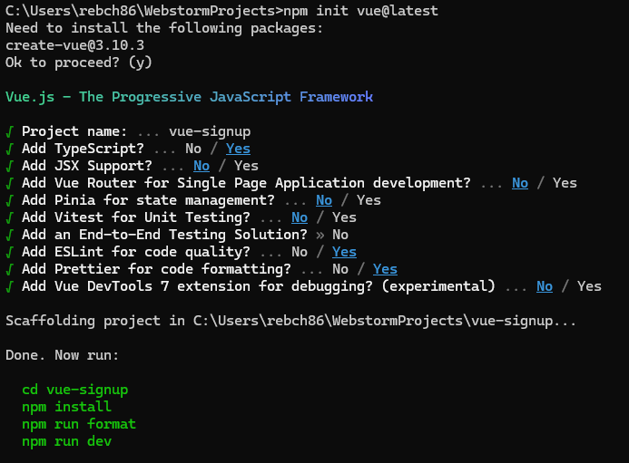

## vue-signup

- Vue3 를 이용하여 제작한 회원가입 페이지
- 회원 가입 페이지는 총 3단계로 구성이 되어있다.

1. 이메일, 비밀번호, 비밀번호 확인 form
2. 이름, 연락처, 주소 form
3. 카드 번호 form

### 프로젝트 구성

- Vue3 + TS
```
npm init vue@latest
```




---

# vue-signup

This template should help get you started developing with Vue 3 in Vite.

## Recommended IDE Setup

[VSCode](https://code.visualstudio.com/) + [Volar](https://marketplace.visualstudio.com/items?itemName=Vue.volar) (and disable Vetur).

## Type Support for `.vue` Imports in TS

TypeScript cannot handle type information for `.vue` imports by default, so we replace the `tsc` CLI with `vue-tsc` for type checking. In editors, we need [Volar](https://marketplace.visualstudio.com/items?itemName=Vue.volar) to make the TypeScript language service aware of `.vue` types.

## Customize configuration

See [Vite Configuration Reference](https://vitejs.dev/config/).

## Project Setup

```sh
npm install
```

### Compile and Hot-Reload for Development

```sh
npm run dev
```

### Type-Check, Compile and Minify for Production

```sh
npm run build
```

### Lint with [ESLint](https://eslint.org/)

```sh
npm run lint
```
